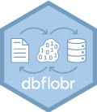

<!-- README.md is generated from README.Rmd. Please edit that file -->

# dbflobr 

<!-- badges: start -->

[](https://lifecycle.r-lib.org/articles/stages.html#stable)
[](https://github.com/poissonconsulting/dbflobr/actions)
[](https://app.codecov.io/gh/poissonconsulting/dbflobr?branch=master)
[](https://opensource.org/licenses/MIT)
[](https://cran.r-project.org/package=dbflobr)

<!-- badges: end -->

`dbflobr` reads and writes files to SQLite databases as
[flobs](https://github.com/poissonconsulting/flobr). A flob is a
[blob](https://github.com/tidyverse/blob) that preserves the file
extension.

## Installation

To install the latest release from [CRAN](https://cran.r-project.org)

``` r
install.packages("dbflobr")
```

To install the developmental version from
[GitHub](https://github.com/poissonconsulting/dbflobr)

``` r
# install.packages("remotes")
remotes::install_github("poissonconsulting/dbflobr")
```

## Demonstration

``` r
library(dbflobr)

# convert a file to flob using flobr
flob <- flobr::flob(system.file("extdata", "flobr.pdf", package = "flobr"))
str(flob)
#> List of 1
#>  $ /Library/Frameworks/R.framework/Versions/4.1/Resources/library/flobr/extdata/flobr.pdf: raw [1:133851] 58 0a 00 00 ...
#>  - attr(*, "class")= chr [1:2] "flob" "blob"

# create a SQLite database connection 
conn <- DBI::dbConnect(RSQLite::SQLite(), ":memory:")

# create a table 'Table1' of data
DBI::dbWriteTable(conn, "Table1", data.frame(IntColumn = c(1L, 2L)))

DBI::dbReadTable(conn, "Table1")
#>   IntColumn
#> 1         1
#> 2         2

# specify which row to add the flob to by providing a key 
key <- data.frame(IntColumn = 2L)

# write the flob to the database in column 'BlobColumn'
write_flob(flob, "BlobColumn", "Table1", key, conn, exists = FALSE)

DBI::dbReadTable(conn, "Table1")
#>   IntColumn      BlobColumn
#> 1         1            <NA>
#> 2         2 blob[133.85 kB]

# read the flob
flob2 <- read_flob("BlobColumn", "Table1", key, conn)
str(flob2)
#> List of 1
#>  $ BlobColumn: raw [1:133851] 58 0a 00 00 ...
#>  - attr(*, "class")= chr [1:2] "flob" "blob"

# delete the flob
delete_flob("BlobColumn", "Table1", key, conn)

DBI::dbReadTable(conn, "Table1")
#>   IntColumn BlobColumn
#> 1         1       <NA>
#> 2         2       <NA>

# close the connection
DBI::dbDisconnect(conn)
```

## Inspiration

-   [blob](https://github.com/tidyverse/blob)
-   [flobr](https://github.com/poissonconsulting/flobr)

## Contribution

Please report any
[issues](https://github.com/poissonconsulting/dbflobr/issues).

[Pull requests](https://github.com/poissonconsulting/dbflobr/pulls) are
always welcome.

## Code of Conduct

Please note that the dbflobr project is released with a [Contributor
Code of
Conduct](https://contributor-covenant.org/version/2/0/CODE_OF_CONDUCT.html).
By contributing to this project, you agree to abide by its terms
